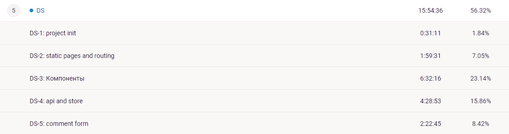

# Тестовое задание

на позицию [Frontend Junior](https://spb.hh.ru/vacancy/55536587?from=negotiations_item&hhtmFrom=negotiations_item)

в компанию [Цифровые Решения](https://pushkeen.ru/)

## Стек:

Языки - JavaScript/TypeScript.

Фреймворк - React/Vue/Angular, state-management на ваш выбор

## Задача

Используя сервис https://jsonplaceholder.typicode.com/ реализовать псевдо-web-приложение

### Список экранов

1. Список пользователей. Вывод списка, полученного по апи в виде карточек вида
   [name,surname]
2. Страница пользователя. Подробный вывод информации о пользователе
   [
    - сверху - username
      (далее по списку)
    - name
    - email
    - phone
    - website
    - company[name,bs]
    - Список из 3-х превью (заголовок, 1 строчка текста...) постов пользователя + возможность посмотреть все
      ]
3. список постов пользователя. Все посты в формате превью + возможность перейти на детальную
4. детальная страница поста со списком всех комментариев c именем и email. так же, внизу экрана добавить кнопку
   добавления комментария. По клику открывается форма с 3 полями имя, email, текс комментария и кнопкой "
   отправить/send" Отправку сделать на тот же сервис.

Требования к внешнему виду: [дизайн из Figma ](https://www.figma.com/file/IpjzEBgEd5Tk3ry5g347Ux/Untitled)

Задание получено: 20.05.2022

## Комментарии исполнителя
1. Честно говоря было-бы несколько вопросов по реализации дизайна, но поскольку спросить было не у кого сделал
   просто и минималистично.
2. Можно было бы реализовать все без использования стэйт-менеджера, опираясь только на локальное состояние
   контейнерных компонентов. Все же решил использовать redux, т.к. это позволило немного сократить количество
   запросов к API (если данные уже есть в хранилище, т.е. были запрошены с другого экрана - мы берем их оттуда, а
   повторный запрос делаем только при перезагрузке страницы).
3. Прелоадеру добавлена дефолтная задержка в 1000 мс для уменьшения эпилептичности интерфейса.
4. Привожу скриншот из тайм-трекера по затраченному времени.

5. Некоторая хаотичность и беспорядок в коммитах связаны с желанием побыстрее закончить с этим, ну и конечно с тем,
   что я один на этом проекте, т.е. никому это не навредит.
